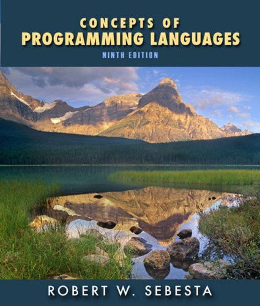

# Hi, I'm a Backend Developer and Computer Enthusiast

I love backend development and learning new things.  
I'm always trying to get better, even if it takes time.  
I enjoy reading about programming theory, language design, and low-level programming.  

In my free time, I like to develop games and play Pokémon and MOBA games.  
I also enjoy fantasy and romantic comedy novels.

---

## Technologies I work with

- Ruby on Rails
- Python (FastAPI, Django)
- Java (Spring Boot)
- C
- Linux
- Docker
- PostgreSQL, MongoDB

---

## Currently Reading

  
  

    
<strong>Concepts of Programming Languages</strong> by Robert W. Sebesta

  

---

📫 Contact me: [cauefaleiros@gmail.com](mailto:cauefaleiros@gmail.com)
