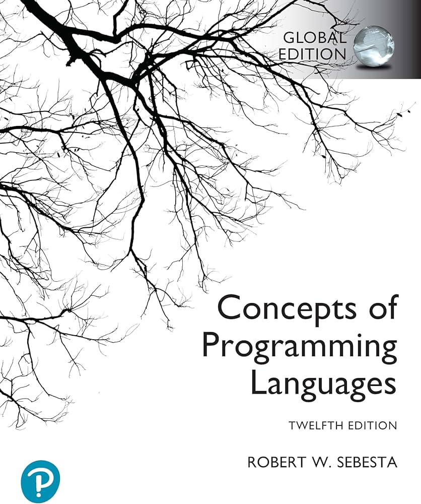
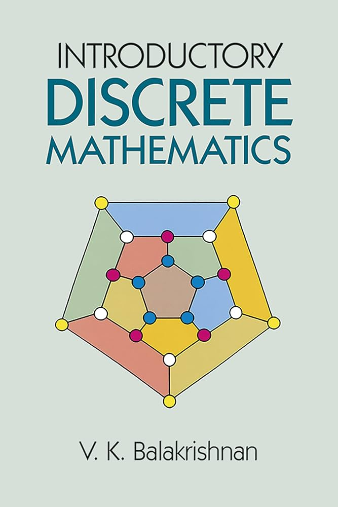

# Hi, I'm a Backend Developer and Computer Enthusiast

Passionate about backend development and always eager to learn new things, constantly working to improve no matter how long it takes. Fascinated by programming theory, language design, and low-level programming. When not coding, I enjoy playing Pokémon and MOBA titles, and I'm also a fan of fantasy and romantic comedy novels, as well as watching anime and reading manga. (｀･ω･´)

---

## Technologies I Work With
- Ruby on Rails
- Python (FastAPI, Django)
- Java (Springboot)
- C
- HTML, CSS
- Linux
- Docker
- PostgreSQL, MongoDB
- Git

---

## Currently Reading
| | |
|---|---|
|  | **Concepts of Programming Languages** *by Robert W. Sebesta*  A comprehensive introduction to programming languages, covering concepts, paradigms, and design. |
|  | **Introductory Discrete Mathematics** *by V. K. Balakrishnan*  An introduction to discrete mathematics, covering fundamental concepts and mathematical structures. |

---

## Contacts
📫 E-mail: [cauefaleiros@gmail.com](mailto:cauefaleiros@gmail.com)  
💼 LinkedIn: [Cauê Faleiros](https://www.linkedin.com/in/cauefaleiros/)
